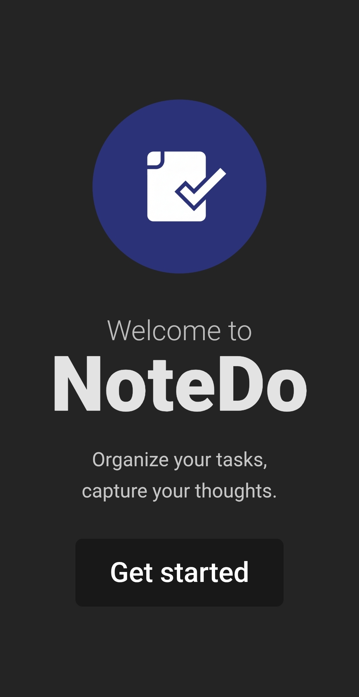
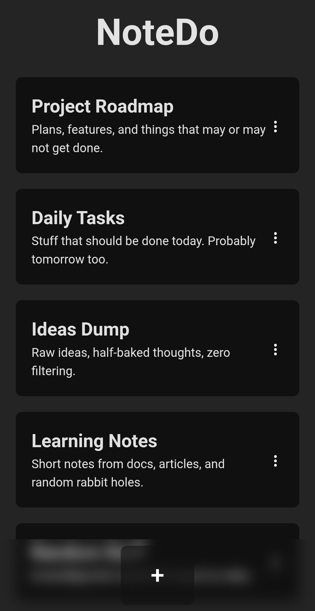
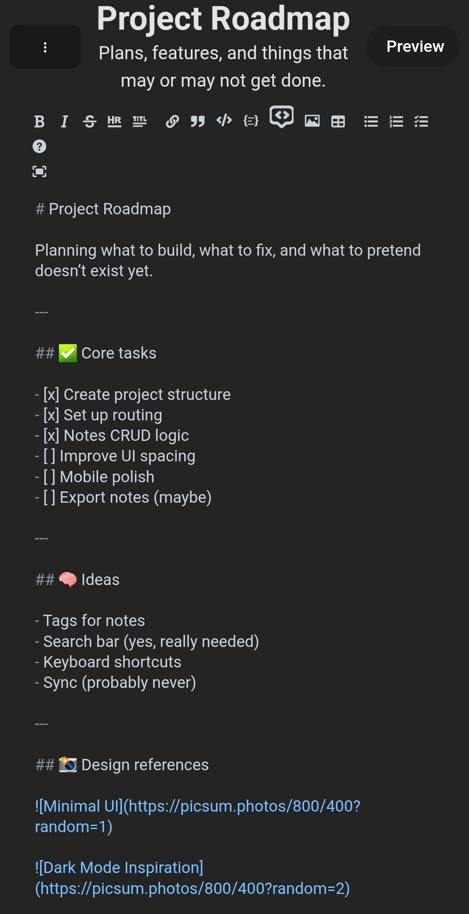
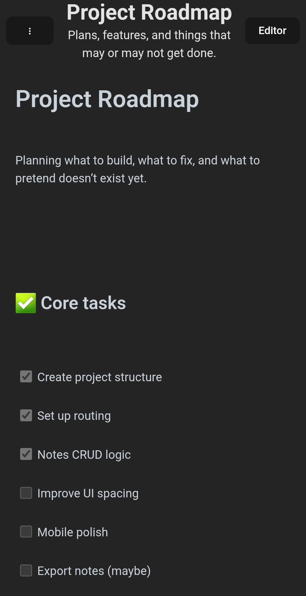
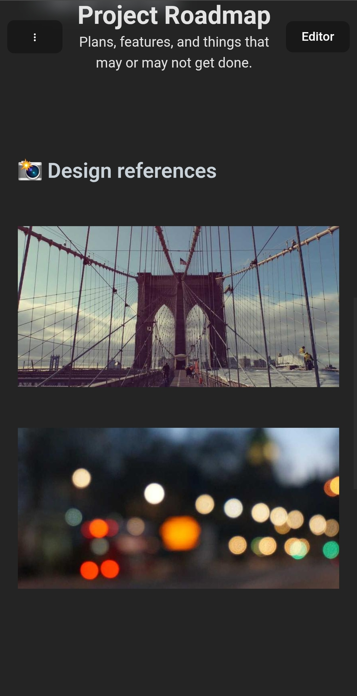

# NoteDo

A simple note-taking app built with **React** and **React Router**.
Create notes, edit them in **Markdown**, rename, delete and manage everything locally.

No backend. No accounts. No sync.
Just notes sitting in your browser like they should.

## Features

- Create, rename and delete notes
- Markdown editor with preview
- Edit note name and description
- Fully offline
- Dark / light mode via system theme
- SPA navigation using HashRouter

## Tech stack

- React
- react-router-dom
- @uiw/react-md-editor
- UUID
- CSS Modules

## Screenshots

| Splash | Notes |
|------|-------|
|  |  |

| Editor | Preview | Preview 2 |
|--------|---------|-----------|
|  |  |  |

## How to run

Install deps:
```bash
npm install
```

Start dev server:
```bash
npm run dev
```

Open browser. Write stuff. Done.

## Storage

All notes are stored in `localStorage`:

```
notedo-saves
```

Clear site data = notes gone. No magic.

## License

MIT

